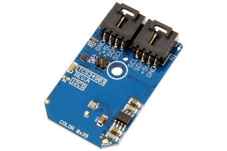

[](https://www.controleverything.com/content/Color?sku=TCS34903FN_I2CS)
# TCS34903
TCS34903 Color Light-to-Digital Converter  

The TCS34903 provides color and IR (red, green, blue, clear and IR) light sensing using I²C communications.

This Device is available from ControlEverything.com [SKU: TCS34903FN_I2CS]

https://www.controleverything.com/content/Color?sku=TCS34903FN_I2CS

This Sample code can be used with Raspberry Pi, Arduino, Particle Photon, Beaglebone Black and Onion Omega.

## Java 
Download and install pi4j library on Raspberry pi. Steps to install pi4j are provided at:

http://pi4j.com/install.html

Download (or git pull) the code in pi.

Compile the java program.
```cpp
$> pi4j TCS34903.java
```

Run the java program as.
```cpp
$> pi4j TCS34903
```

## Python 
Download and install smbus library on Raspberry pi. Steps to install smbus are provided at:

https://pypi.python.org/pypi/smbus-cffi/0.5.1

Download (or git pull) the code in pi. Run the program

```cpp
$> python TCS34903.py
```
## Arduino
Download and install Arduino Software (IDE) on your machine. Steps to install Arduino are provided at:
 
https://www.arduino.cc/en/Main/Software
 
Download (or git pull) the code and double click the file to run the program.
 
Compile and upload the code on Arduino IDE and see the output on Serial Monitor.
 
 
## Particle Photon
Login to your Photon and setup your device according to steps provided at:
 
https://docs.particle.io/guide/getting-started/connect/photon/
 
Download (or git pull) the code. Go to online IDE and copy the code.
 
https://build.particle.io/build/
 
Verify and flash the code on your Photon. Code output is shown in logs at dashboard:
 
https://dashboard.particle.io/user/logs


## C

Download (or git pull) the code in Beaglebone Black.

Compile the c program.
```cpp
$>gcc TCS34903.c -o TCS34903
```
Run the c program.
```cpp
$>./TCS34903
```

## Onion Omega

Get Started and setting up the Onion Omega according to steps provided at :

https://wiki.onion.io/Get-Started

To install the Python module, run the following commands:
```cpp
opkg update
```
```cpp
opkg install python-light pyOnionI2C
```

Download (or git pull) the code in Onion Omega. Run the program.

```cpp
$> python TCS34903.py
```

## Windows 10 IoT Core
 
To download Windows 10 IoT Core, visit Get Started page
 
https://developer.microsoft.com/en-us/windows/iot/GetStarted
 
Download (or git pull) the sample, make a copy on your disk and open the project from Visual Studio.

Note: Your IoT Core device and development PC should be connected to same local Network.

#####The code output is the lux value of IR , RGB  and total luminance.
